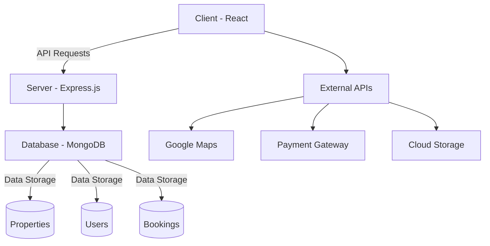
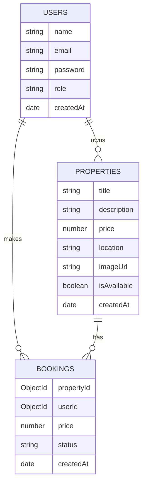

# 🌇 Horizon Homes: Smart Property Discovery & Management Platform


**Horizon Homes** is a cutting-edge MERN stack real estate platform revolutionizing property search, listing, and reservation. Designed for both property seekers and professionals, it offers a seamless, secure, and feature-rich experience for all real estate needs.

[](https://opensource.org/licenses/MIT)


[](https://reactjs.org/)

## 🌟 Key Features

| Feature | Description |
|---------|-------------|
| 🔐 **Secure Authentication** | JWT-based login with role-based access (Visitor, Agent, Admin) |
| 🏠 **Real-Time Property Management** | Full CRUD operations for property listings with instant updates |
| 💳 **Online Booking & Payments** | Secure reservation system with payment processing |
| 🧮 **Mortgage Calculator** | Estimate monthly payments based on financial inputs |
| 📍 **Neighborhood Insights** | Local area information (schools, transport, safety ratings) |
| 📱 **Mobile-First Design** | Fully responsive across all devices |
| 📊 **Admin Dashboard** | Comprehensive management of users, properties & bookings |
| 🖼️ **Virtual Tours** | Interactive 360° property exploration |
| 🔍 **Advanced Search** | Filter properties by location, price, amenities & more |
| ⚖️ **Property Comparison** | Side-by-side comparison of up to 3 properties |

## 🛠️ Tech Stack

### Frontend


### Backend


### Utilities & Services


## 📂 Project Structure

```
real-estate/
├── backend/               # Backend server
│   ├── config/           # Configuration files
│   ├── controllers/      # Route controllers
│   ├── middleware/       # Custom middleware (authentication, etc.)
│   ├── models/           # MongoDB models (User, Property, Booking)
│   ├── routes/           # API routes
│   ├── utils/            # Utility functions
│   ├── .env              # Environment variables
│   ├── server.js         # Main server file
│   └── package.json
├── client/                # Frontend React app
│   ├── public/           # Static assets
│   ├── src/              # Source code
│   │   ├── assets/       # Images, icons, etc.
│   │   ├── components/   # Reusable components
│   │   ├── context/      # React context providers
│   │   ├── pages/        # Page components
│   │   ├── services/     # API service functions
│   │   ├── styles/       # CSS files
│   │   ├── utils/        # Frontend utilities
│   │   ├── App.jsx       # Main application component
│   │   └── index.jsx     # Entry point
│   ├── .env
│   └── package.json
├── .gitignore
├── LICENSE
└── README.md
```

## 🚀 Getting Started

### Prerequisites
- Node.js (v18 or higher)
- npm (v9 or higher)
- MongoDB Atlas account or local MongoDB installation

### Installation

1. **Clone the repository**:
```bash
git clone https://github.com/your-username/horizon-homes.git
cd horizon-homes
```

2. **Install backend dependencies**:
```bash
cd backend
npm install
```

3. **Install frontend dependencies**:
```bash
cd ../client
npm install
```

4. **Set up environment variables**:
Create a `.env` file in the `backend` directory with:
```env
MONGODB_URI=your_mongodb_connection_string
JWT_SECRET=your_jwt_secret_key
PORT=5000
```

5. **Seed the database (optional)**:
```bash
cd backend
npm run seed
```

6. **Start the development servers**:
```bash
# Start backend server
cd backend
npm run dev

# Start frontend server
cd ../client
npm run dev
```

7. **Access the application**:
Open your browser and visit `http://localhost:3000`

## Screenshots 📸
Home Page
(https://i.postimg.cc/GmqqLkkp/Screenshot-2025-07-08-111527.png)
Property Listing
https://via.placeholder.com/400x250/8b5cf6/ffffff?text=Property+Listing
Admin Dashboard
https://via.placeholder.com/400x250/10b981/ffffff?text=Admin+Dashboard	Mortgage Calculator
https://via.placeholder.com/400x250/ef4444/ffffff?text=Mortgage+Calculator
</div>

## 💻 Code Snippets

### Backend: Property Model
```javascript
// backend/models/Property.js
const mongoose = require('mongoose');

const propertySchema = new mongoose.Schema({
  title: { type: String, required: true },
  description: { type: String, required: true },
  price: { type: Number, required: true },
  location: { type: String, required: true },
  imageUrl: { type: String, required: true },
  owner: { 
    type: mongoose.Schema.Types.ObjectId, 
    ref: 'User', 
    required: true 
  },
  bedrooms: { type: Number, required: true },
  bathrooms: { type: Number, required: true },
  area: { type: Number, required: true },
  amenities: [String],
  virtualTourUrl: String,
  mapUrl: String,
  isAvailable: { type: Boolean, default: true }
}, { timestamps: true });

module.exports = mongoose.model('Property', propertySchema);
```

### Frontend: Mortgage Calculator
```jsx
// client/src/components/MortgageCalculator.jsx
import React, { useState } from 'react';

const MortgageCalculator = () => {
  const [formData, setFormData] = useState({
    homePrice: 300000,
    downPayment: 60000,
    loanTerm: 30,
    interestRate: 4.5,
  });

  const calculatePayment = () => {
    const { homePrice, downPayment, loanTerm, interestRate } = formData;
    const loanAmount = homePrice - downPayment;
    const monthlyRate = interestRate / 100 / 12;
    const numberOfPayments = loanTerm * 12;
    
    const monthlyPayment = (
      loanAmount * 
      (monthlyRate * Math.pow(1 + monthlyRate, numberOfPayments)) / 
      (Math.pow(1 + monthlyRate, numberOfPayments) - 1)
    );
    
    return monthlyPayment.toFixed(2);
  };

  return (
    <div className="bg-white rounded-xl shadow-lg p-6">
      <h2 className="text-2xl font-bold mb-4">Mortgage Calculator</h2>
      {/* Input fields and calculation display */}
    </div>
  );
};
```

## 🏗️ Architecture Overview



## 🔧 Challenges & Solutions

| Challenge | Solution |
|-----------|----------|
| **Real-Time Data Sync** | Implemented MongoDB Change Streams for instant updates |
| **Role-Based Access** | JWT authentication with middleware authorization checks |
| **Image Handling** | Cloudinary integration with compression and lazy loading |
| **Search Performance** | MongoDB indexing and optimized query design |
| **Payment Processing** | Stripe integration with secure payment intents |
| **Responsive Design** | Mobile-first approach with Tailwind CSS |

## 📊 Database Schema



## 🤝 Contributing

We welcome contributions! Please follow these steps:

1. Fork the repository
2. Create a new branch (`git checkout -b feature/your-feature`)
3. Commit your changes (`git commit -am 'Add some feature'`)
4. Push to the branch (`git push origin feature/your-feature`)
5. Open a pull request

## 📜 License

This project is licensed under the MIT License - see the [LICENSE](LICENSE) file for details.

## ✨ Contributors

- [Your Name](https://github.com/your-profile)
- [Team Member 2](https://github.com/team-member2)

---

**Find your dream home today with Horizon Homes!** 🏡  
[Live Demo](https://horizon-homes-demo.com) | [API Documentation](https://horizon-homes-api.com) | [Support](mailto:support@horizon-homes.com)
