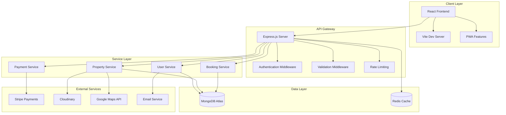
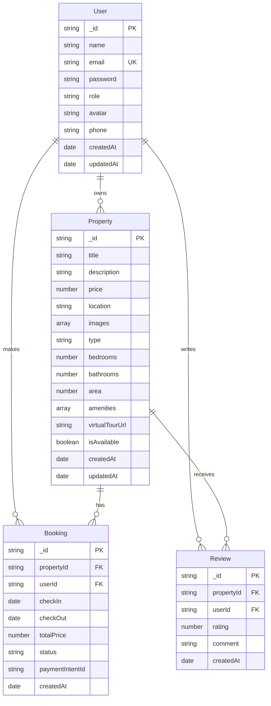

# 🌇 Horizon Homes: Smart Property Discovery & Management Platform


**Horizon Homes** is a comprehensive MERN stack real estate platform designed to revolutionize property search, listing, and reservation. Built with modern technologies and user-centric design principles, it provides a seamless experience for property seekers, real estate agents, and administrators alike.

[](https://opensource.org/licenses/MIT)


 

## 📋 Table of Contents

- [Features](#-features)
- [Tech Stack](#-tech-stack)
- [Installation](#-installation)
- [Project Structure](#-project-structure)
- [Architecture](#-architecture)
- [API Documentation](#-api-documentation)
- [Database Schema](#-database-schema)
- [Screenshots](#-screenshots)
- [Contributing](#-contributing)
- [License](#-license)

## ✨ Features

### 🎯 Core Features
- **🔐 Multi-Role Authentication**: Secure JWT-based authentication with three distinct user roles (Visitor, Agent, Admin)
- **🏠 Advanced Property Management**: Full CRUD operations for property listings with real-time updates
- **💳 Integrated Payment System**: Secure reservation system with Stripe payment processing
- **🧮 Intelligent Mortgage Calculator**: Interactive calculator for financial planning and affordability assessment

### 🔍 Discovery & Exploration
- **📍 Smart Search & Filtering**: Advanced filtering by location, price range, amenities, and property type
- **⚖️ Property Comparison Tool**: Side-by-side comparison of up to 3 properties with detailed metrics
- **📊 Neighborhood Insights**: Comprehensive local area information including schools, transportation, and safety ratings
- **🖼️ Virtual Property Tours**: Interactive 360° virtual tours for immersive property exploration

### 👥 User Experience
- **📱 Mobile-First Responsive Design**: Optimized experience across all devices and screen sizes
- **📊 Personalized Dashboards**: Custom dashboards for each user role with relevant insights
- **⭐ Review & Rating System**: User-generated reviews and ratings for properties and agents
- **🔔 Real-Time Notifications**: Instant updates on bookings, messages, and property status changes

### 🛠️ Administrative Tools
- **📈 Comprehensive Admin Panel**: Centralized management of users, properties, and bookings
- **📊 Analytics Dashboard**: Visual insights on platform performance and user engagement
- **👥 User Management**: Advanced user management with role assignment and permissions
- **📋 Content Moderation**: Tools for reviewing and managing property listings and user content

## 🛠️ Tech Stack

### Frontend
- **React 18** - Component-based UI library
- **Vite** - Next-generation frontend tooling
- **Tailwind CSS** - Utility-first CSS framework
- **React Router** - Declarative routing
- **Axios** - Promise-based HTTP client
- **React Context API** - State management
- **Framer Motion** - Animation library

### Backend
- **Node.js** - JavaScript runtime environment
- **Express.js** - Web application framework
- **MongoDB** - NoSQL database
- **Mongoose** - MongoDB object modeling
- **JWT** - JSON Web Tokens for authentication
- **Bcrypt.js** - Password hashing
- **Express Validator** - Input validation

### Third-Party Services
- **Stripe API** - Payment processing
- **Cloudinary** - Cloud image and video management
- **Google Maps API** - Location services and mapping
- **EmailJS** - Email notification service

### Development Tools
- **Postman** - API testing and documentation
- **Git** - Version control
- **ESLint** - Code linting
- **Prettier** - Code formatting

## 📂 Project Structure

```
horizon-homes/
├── backend/
│   ├── config/
│   │   ├── database.js          # MongoDB connection setup
│   │   └── cloudinary.js        # Cloudinary configuration
│   ├── controllers/
│   │   ├── authController.js    # Authentication logic
│   │   ├── propertyController.js # Property CRUD operations
│   │   ├── bookingController.js # Booking management
│   │   └── userController.js    # User management
│   ├── middleware/
│   │   ├── authMiddleware.js    # Authentication middleware
│   │   ├── errorMiddleware.js   # Error handling
│   │   └── uploadMiddleware.js  # File upload handling
│   ├── models/
│   │   ├── User.js             # User schema
│   │   ├── Property.js         # Property schema
│   │   ├── Booking.js          # Booking schema
│   │   └── Review.js           # Review schema
│   ├── routes/
│   │   ├── authRoutes.js       # Authentication endpoints
│   │   ├── propertyRoutes.js   # Property endpoints
│   │   ├── bookingRoutes.js    # Booking endpoints
│   │   └── userRoutes.js       # User endpoints
│   ├── utils/
│   │   ├── emailService.js     # Email utility functions
│   │   ├── validators.js       # Input validation
│   │   └── helpers.js          # Helper functions
│   ├── .env                    # Environment variables
│   ├── server.js               # Main server file
│   ├── package.json
│   └── seed.js                 # Database seeding script
└── client/
    ├── public/
    │   ├── index.html
    │   └── assets/             # Static assets
    ├── src/
    │   ├── components/
    │   │   ├── common/         # Reusable UI components
    │   │   ├── layout/         # Layout components
    │   │   ├── property/       # Property-related components
    │   │   └── user/           # User-related components
    │   ├── context/
    │   │   ├── AuthContext.jsx # Authentication context
    │   │   └── PropertyContext.jsx # Property context
    │   ├── pages/
    │   │   ├── Home.jsx        # Home page
    │   │   ├── Properties.jsx  # Property listing
    │   │   ├── PropertyDetails.jsx # Property details
    │   │   ├── Dashboard.jsx   # User dashboard
    │   │   ├── Admin.jsx       # Admin panel
    │   │   └── Auth/           # Authentication pages
    │   ├── services/
    │   │   ├── api.js          # API service configuration
    │   │   ├── authService.js  # Authentication services
    │   │   └── propertyService.js # Property services
    │   ├── utils/
    │   │   ├── constants.js    # Application constants
    │   │   ├── formatters.js   # Data formatting utilities
    │   │   └── validators.js   # Client-side validation
    │   ├── styles/
    │   │   ├── main.css        # Global styles
    │   │   └── tailwind.css    # Tailwind directives
    │   ├── App.jsx             # Main application component
    │   └── main.jsx            # Application entry point
    ├── .env                    # Frontend environment variables
    ├── index.html
    ├── package.json
    └── vite.config.js          # Vite configuration
```

## 🚀 Installation

### Prerequisites

- **Node.js** (v18 or higher)
- **npm** (v9 or higher) or **yarn**
- **MongoDB** (Atlas or local instance)
- **Stripe Account** (for payment processing)
- **Cloudinary Account** (for image storage)

### Step 1: Clone the Repository

```bash
git clone https://github.com/your-username/horizon-homes.git
cd horizon-homes
```

### Step 2: Backend Setup

```bash
# Navigate to backend directory
cd backend

# Install dependencies
npm install

# Create environment variables file
cp .env.example .env

# Edit .env file with your configurations
# Required variables:
# MONGODB_URI=your_mongodb_connection_string
# JWT_SECRET=your_jwt_secret_key
# STRIPE_SECRET_KEY=your_stripe_secret_key
# CLOUDINARY_CLOUD_NAME=your_cloudinary_cloud_name
# CLOUDINARY_API_KEY=your_cloudinary_api_key
# CLOUDINARY_API_SECRET=your_cloudinary_api_secret
```

### Step 3: Frontend Setup

```bash
# Navigate to frontend directory
cd ../client

# Install dependencies
npm install

# Create environment variables file
cp .env.example .env

# Edit .env file with your configurations
# Required variables:
# VITE_API_BASE_URL=http://localhost:5000/api
# VITE_STRIPE_PUBLIC_KEY=your_stripe_public_key
```

### Step 4: Database Setup

```bash
# Navigate to backend directory
cd ../backend

# Seed the database with sample data (optional)
npm run seed
```

### Step 5: Running the Application

**Development Mode:**

```bash
# Start backend server (from backend directory)
npm run dev

# Start frontend server (from client directory in new terminal)
npm run dev
```

**Production Mode:**

```bash
# Build the frontend
cd client
npm run build

# Start production server
cd ../backend
npm start
```

### Step 6: Access the Application

- Frontend: `http://localhost:3000`
- Backend API: `http://localhost:5000`
- Admin Credentials (if seeded): admin@example.com / admin123

## 🏗️ Architecture

### System Architecture


```mermaid
graph TB
    subgraph "Client Layer"
        A[React Frontend] --> B[Vite Dev Server]
        A --> C[PWA Features]
    end
    
    subgraph "API Gateway"
        D[Express.js Server]
        D --> E[Authentication Middleware]
        D --> F[Validation Middleware]
        D --> G[Rate Limiting]
    end
    
    subgraph "Service Layer"
        H[User Service]
        I[Property Service]
        J[Booking Service]
        K[Payment Service]
    end
    
    subgraph "Data Layer"
        L[(MongoDB Atlas)]
        M[(Redis Cache)]
    end
    
    subgraph "External Services"
        N[Stripe Payments]
        O[Cloudinary]
        P[Google Maps API]
        Q[Email Service]
    end
    
    A --> D
    D --> H
    D --> I
    D --> J
    D --> K
    H --> L
    I --> L
    J --> L
    K --> N
    I --> O
    I --> P
    H --> Q
    D --> M
```

### Database Schema


```mermaid
erDiagram
    User {
        string _id PK
        string name
        string email UK
        string password
        string role
        string avatar
        string phone
        date createdAt
        date updatedAt
    }
    
    Property {
        string _id PK
        string title
        string description
        number price
        string location
        array images
        string type
        number bedrooms
        number bathrooms
        number area
        array amenities
        string virtualTourUrl
        boolean isAvailable
        date createdAt
        date updatedAt
    }
    
    Booking {
        string _id PK
        string propertyId FK
        string userId FK
        date checkIn
        date checkOut
        number totalPrice
        string status
        string paymentIntentId
        date createdAt
    }
    
    Review {
        string _id PK
        string propertyId FK
        string userId FK
        number rating
        string comment
        date createdAt
    }
    
    User ||--o{ Property : "owns"
    User ||--o{ Booking : "makes"
    User ||--o{ Review : "writes"
    Property ||--o{ Booking : "has"
    Property ||--o{ Review : "receives"
```

## 📡 API Documentation

### Authentication Endpoints

| Method | Endpoint | Description | Auth Required |
|--------|----------|-------------|---------------|
| POST | `/api/auth/register` | Register new user | No |
| POST | `/api/auth/login` | User login | No |
| POST | `/api/auth/logout` | User logout | Yes |
| GET | `/api/auth/me` | Get current user | Yes |

### Property Endpoints

| Method | Endpoint | Description | Auth Required |
|--------|----------|-------------|---------------|
| GET | `/api/properties` | Get all properties | No |
| GET | `/api/properties/:id` | Get single property | No |
| POST | `/api/properties` | Create property | Yes (Agent/Admin) |
| PUT | `/api/properties/:id` | Update property | Yes (Owner/Admin) |
| DELETE | `/api/properties/:id` | Delete property | Yes (Owner/Admin) |
| GET | `/api/properties/search` | Search properties | No |

### Booking Endpoints

| Method | Endpoint | Description | Auth Required |
|--------|----------|-------------|---------------|
| POST | `/api/bookings` | Create booking | Yes |
| GET | `/api/bookings` | Get user bookings | Yes |
| GET | `/api/bookings/:id` | Get single booking | Yes |
| PUT | `/api/bookings/:id/cancel` | Cancel booking | Yes |
| POST | `/api/bookings/:id/payment` | Process payment | Yes |

### Sample API Request

```javascript
// Create a new property
const response = await axios.post('/api/properties', {
    title: "Modern Apartment in Downtown",
    description: "Beautiful 2-bedroom apartment...",
    price: 250000,
    location: "New York, NY",
    bedrooms: 2,
    bathrooms: 2,
    area: 1200,
    amenities: ["Swimming Pool", "Gym", "Parking"],
    type: "Apartment"
}, {
    headers: {
        'Authorization': `Bearer ${token}`,
        'Content-Type': 'application/json'
    }
});
```

## 📸 Screenshots

### Home Page

*Modern landing page with property search and featured listings*

### Property Listings

*Grid view of available properties with filtering options*

### Admin Dashboard

*Comprehensive admin panel with analytics and management tools*

### Mortgage Calculator

*Interactive mortgage calculator with real-time calculations*

### Virtual Tour

*Immersive 360° virtual property tour*

### Property Comparison

*Side-by-side comparison of selected properties*

### Authentication

*Secure login page with validation*


*User registration form*

### Agent Portal

*Agent dashboard for managing listings*

### Reviews & Feedback

*User review and rating interface*

### Neighborhood Insights

*Detailed neighborhood information and insights*

### User Panel

*Personalized user dashboard*

### Database Management

*User management interface*


*Property database management*


*Booking management system*

## 🔧 Key Code Snippets

### Backend: Property Model with Validation

```javascript
// backend/models/Property.js
const mongoose = require('mongoose');

const propertySchema = new mongoose.Schema({
    title: {
        type: String,
        required: [true, 'Property title is required'],
        trim: true,
        maxlength: [100, 'Title cannot exceed 100 characters']
    },
    description: {
        type: String,
        required: [true, 'Property description is required'],
        minlength: [50, 'Description must be at least 50 characters']
    },
    price: {
        type: Number,
        required: [true, 'Price is required'],
        min: [0, 'Price cannot be negative']
    },
    location: {
        address: String,
        city: String,
        state: String,
        zipCode: String,
        coordinates: {
            lat: Number,
            lng: Number
        }
    },
    images: [{
        url: String,
        publicId: String,
        isPrimary: { type: Boolean, default: false }
    }],
    specifications: {
        bedrooms: { type: Number, min: 0 },
        bathrooms: { type: Number, min: 0 },
        area: { type: Number, min: 0 },
        yearBuilt: Number,
        propertyType: {
            type: String,
            enum: ['House', 'Apartment', 'Condo', 'Townhouse', 'Land']
        }
    },
    amenities: [{
        type: String,
        enum: ['Swimming Pool', 'Gym', 'Parking', 'Garden', 'Balcony', 'Security']
    }],
    status: {
        type: String,
        enum: ['Available', 'Pending', 'Sold', 'Rented'],
        default: 'Available'
    },
    owner: {
        type: mongoose.Schema.Types.ObjectId,
        ref: 'User',
        required: true
    },
    virtualTourUrl: String,
    createdAt: { type: Date, default: Date.now },
    updatedAt: { type: Date, default: Date.now }
});

// Indexes for better query performance
propertySchema.index({ location: 'text', title: 'text' });
propertySchema.index({ price: 1 });
propertySchema.index({ 'location.city': 1 });
propertySchema.index({ status: 1 });

module.exports = mongoose.model('Property', propertySchema);
```

### Frontend: Mortgage Calculator Component

```jsx
// client/src/components/MortgageCalculator.jsx
import React, { useState, useEffect } from 'react';
import { Calculator, DollarSign, Percent, Calendar } from 'lucide-react';

const MortgageCalculator = ({ propertyPrice }) => {
    const [formData, setFormData] = useState({
        homePrice: propertyPrice || 300000,
        downPayment: 60000,
        downPaymentPercent: 20,
        loanTerm: 30,
        interestRate: 4.5,
        propertyTax: 1.2,
        insurance: 1000,
        pmi: 0.5
    });

    const [results, setResults] = useState({
        monthlyPayment: 0,
        totalInterest: 0,
        totalPayment: 0,
        breakdown: {}
    });

    const calculateMortgage = () => {
        const {
            homePrice,
            downPayment,
            loanTerm,
            interestRate,
            propertyTax,
            insurance,
            pmi
        } = formData;

        const loanAmount = homePrice - downPayment;
        const monthlyRate = interestRate / 100 / 12;
        const numberOfPayments = loanTerm * 12;
        
        // Calculate monthly mortgage payment
        const monthlyMortgage = loanAmount * 
            (monthlyRate * Math.pow(1 + monthlyRate, numberOfPayments)) / 
            (Math.pow(1 + monthlyRate, numberOfPayments) - 1);
        
        // Calculate additional monthly costs
        const monthlyTax = (homePrice * (propertyTax / 100)) / 12;
        const monthlyInsurance = insurance / 12;
        const monthlyPMI = downPayment < (homePrice * 0.2) ? 
            (loanAmount * (pmi / 100)) / 12 : 0;
        
        const totalMonthly = monthlyMortgage + monthlyTax + monthlyInsurance + monthlyPMI;
        const totalInterest = (monthlyMortgage * numberOfPayments) - loanAmount;
        const totalPayment = totalMonthly * numberOfPayments;

        setResults({
            monthlyPayment: totalMonthly.toFixed(2),
            totalInterest: totalInterest.toFixed(2),
            totalPayment: totalPayment.toFixed(2),
            breakdown: {
                principalInterest: monthlyMortgage.toFixed(2),
                propertyTax: monthlyTax.toFixed(2),
                insurance: monthlyInsurance.toFixed(2),
                pmi: monthlyPMI.toFixed(2)
            }
        });
    };

    useEffect(() => {
        calculateMortgage();
    }, [formData]);

    const handleInputChange = (e) => {
        const { name, value } = e.target;
        setFormData(prev => ({
            ...prev,
            [name]: parseFloat(value) || 0,
            ...(name === 'downPaymentPercent' && {
                downPayment: (prev.homePrice * (parseFloat(value) / 100))
            }),
            ...(name === 'downPayment' && {
                downPaymentPercent: ((parseFloat(value) / prev.homePrice) * 100)
            })
        }));
    };

    return (
        <div className="bg-white rounded-2xl shadow-xl p-6 md:p-8">
            <div className="flex items-center gap-3 mb-6">
                <Calculator className="w-8 h-8 text-blue-600" />
                <h2 className="text-2xl font-bold text-gray-800">Mortgage Calculator</h2>
            </div>

            <div className="grid md:grid-cols-2 gap-6">
                {/* Input Controls */}
                <div className="space-y-4">
                    <div>
                        <label className="flex items-center gap-2 text-sm font-medium text-gray-700 mb-2">
                            <DollarSign className="w-4 h-4" /> Home Price
                        </label>
                        <input
                            type="range"
                            name="homePrice"
                            min="50000"
                            max="2000000"
                            step="10000"
                            value={formData.homePrice}
                            onChange={handleInputChange}
                            className="w-full"
                        />
                        <div className="flex justify-between mt-1">
                            <span className="text-sm text-gray-500">$50K</span>
                            <span className="text-lg font-semibold">${formData.homePrice.toLocaleString()}</span>
                            <span className="text-sm text-gray-500">$2M</span>
                        </div>
                    </div>

                    {/* Additional input controls for other fields */}
                </div>

                {/* Results Display */}
                <div className="bg-gradient-to-br from-blue-50 to-indigo-50 rounded-xl p-6">
                    <h3 className="text-lg font-semibold text-gray-800 mb-4">Monthly Payment</h3>
                    <div className="text-center mb-6">
                        <div className="text-4xl font-bold text-blue-600">
                            ${results.monthlyPayment}
                        </div>
                        <p className="text-gray-600 mt-2">per month</p>
                    </div>

                    <div className="space-y-3">
                        <div className="flex justify-between">
                            <span className="text-gray-600">Principal & Interest</span>
                            <span className="font-medium">${results.breakdown.principalInterest}</span>
                        </div>
                        {/* Additional breakdown items */}
                    </div>

                    <div className="mt-6 pt-6 border-t border-gray-200">
                        <div className="flex justify-between mb-2">
                            <span className="text-gray-600">Total Interest Paid</span>
                            <span className="font-semibold">${results.totalInterest}</span>
                        </div>
                        <div className="flex justify-between">
                            <span className="text-gray-600">Total Payment</span>
                            <span className="font-semibold">${results.totalPayment}</span>
                        </div>
                    </div>
                </div>
            </div>
        </div>
    );
};

export default MortgageCalculator;
```

## 🎯 Challenges & Solutions

| Challenge | Solution | Technologies Used |
|-----------|----------|-------------------|
| **Real-time Property Updates** | Implemented WebSocket connections for live updates | Socket.io, MongoDB Change Streams |
| **Image Upload & Optimization** | Cloudinary integration with automatic optimization | Cloudinary API, Sharp.js |
| **Complex Search Queries** | Advanced filtering system with MongoDB aggregation | MongoDB Aggregation Pipeline |
| **Payment Processing Security** | PCI-compliant payment flow with Stripe | Stripe Elements, Payment Intents |
| **Performance Optimization** | Implemented caching and lazy loading | Redis, React.lazy, Image optimization |
| **Mobile Responsiveness** | Mobile-first design approach | Tailwind CSS, Responsive breakpoints |
| **SEO Optimization** | Server-side rendering for critical pages | React Helmet, Meta tags |
| **Data Validation** | Comprehensive validation on both client and server | Joi, Express Validator, Formik |

## 🤝 Contributing

We welcome contributions from the community! Here's how you can help:

### Development Workflow

1. **Fork the Repository**
   ```bash
   git fork https://github.com/your-username/horizon-homes.git
   ```

2. **Set Up Development Environment**
   ```bash
   # Create a feature branch
   git checkout -b feature/your-feature-name
   
   # Install dependencies
   cd backend && npm install
   cd ../client && npm install
   ```

3. **Make Your Changes**
   - Follow the existing code style
   - Add tests for new features
   - Update documentation as needed

4. **Commit Your Changes**
   ```bash
   git commit -m "feat: add your feature description"
   ```

5. **Push and Create Pull Request**
   ```bash
   git push origin feature/your-feature-name
   ```

### Contribution Guidelines

- 🔍 **Code Quality**: Ensure your code passes all linting checks
- ✅ **Testing**: Add unit/integration tests for new features
- 📚 **Documentation**: Update README and add comments for complex logic
- 🔒 **Security**: Follow security best practices for any new endpoints
- ♿ **Accessibility**: Ensure new components are accessible

### Issue Reporting

When reporting issues, please include:
- Steps to reproduce
- Expected vs actual behavior
- Screenshots if applicable
- Browser/device information

## 📄 License

This project is licensed under the MIT License - see the [LICENSE](LICENSE) file for details.

## 👥 Contributors

### Core Team
- **[Jablay Noor Rahman (Omi)](https://github.com/omijr123)** - Project Lead
- **[Md Nazmus Sajjad Naiem]** - Frontend Specialist & UI/UX Designer


*If you find this project useful, please consider giving it a star ⭐*

</div>
